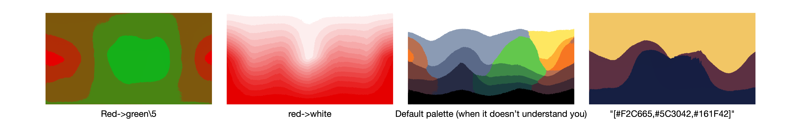

# Image filters

## Color Mapper

### `color_mapper`

> Default: `None`

`color_mapper` can either be `"lookup"`or `None`. Lookup uses the `ColorLookup` class, which, for a single specified palette, maps colors on the generated image (output) to the nearest color on the palette. This is a hard constraint and is performed first, before any losses or prompt evaluations are made. The syntax in which the palettes are created are best demonstrated in the colab demo [here](https://colab.research.google.com/github/dribnet/clipit/blob/master/demos/palette_enforcement.ipynb). The palettes are taken in by another parameter `target_palette`.

### `target_palette`

> Default: `None`

A ramp between two colors are indicated using an arrow `->`, there will be 16 shades between the two colors generated. For example: `"red->white"` Note that spaces are allowed, so that colors like `"light pink"` can be processed

Multiple arrows can be used in one expression to indicate a 16 color ramp between the colors, in that order. "Red->white->black" is very different from` "black->red->white"`. Note that `"black->red->white->black"` covers all three ranks, but for four colors it seems like hell. Feels janky: use with caution.

A single name of the color is equivalent to ramping that color to black. For example:` "red"`

A backslash, `\`, is used to specify the number of in-between shades. For example: `"red->white\4"`

Multiple elements are separated by semicolons, `;`. For example:` "red->white; green->yellow\30"`

A singular color can be specified using a bracket `[]`. For example: `"red->white; [green]"`

RGB values can only be specified within brackets as single colors, but not in ramps, unfortunately.



Another note is that when using the replicate interface, when only using single colors, encapsulate the brackets in quotation marks, but when using something else along with it, don't. For example this: 

```
target_palette: white->black\8;[red]
target_palette: "[white,black,red]"
```

A kinda workaround, but hey, WIP.