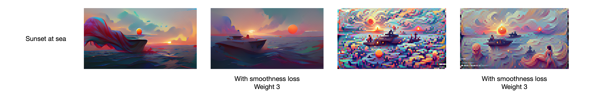
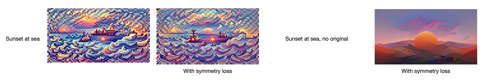
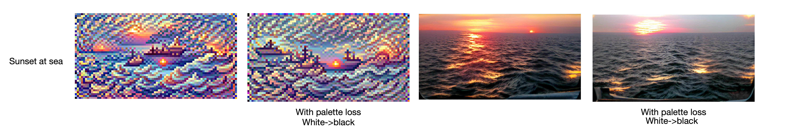

# Losses

For losses to be used, `custom_loss` must be specified for that particular class. Currently there can be a total of four classes, `saturation`, `smoothness`, `symmetry`, and `palette`. To enable all losses use this syntax: separate loss names by commas, using a big string.

```
custom_loss="saturation, smoothness, symmetry, palette"
```


## `Saturation Loss`

```
custom_loss="saturation"
```

### `saturation_weight`

> Default: `1`

Creates a loss based on how colorful the image is, encourages the image to become more colorful. A negative value will reduce saturation.


## `Smoothness Loss`
```
custom_loss="smoothness"
```

### `smoothness_weight`

> Default: `1`



## `Symmetry Loss`

```
custom_loss="symmetry"
```

### `symmetry_weight`

> Default: `1`



## `Palette Loss`

```
custom_loss="palette"
```

### `palette_weight`

> Default: `1`




